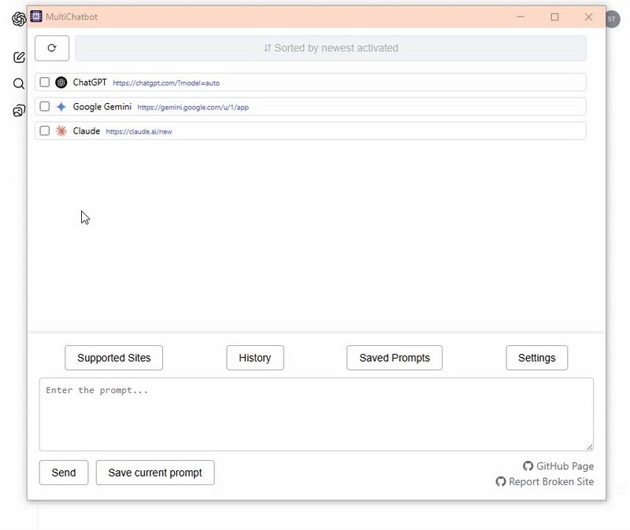
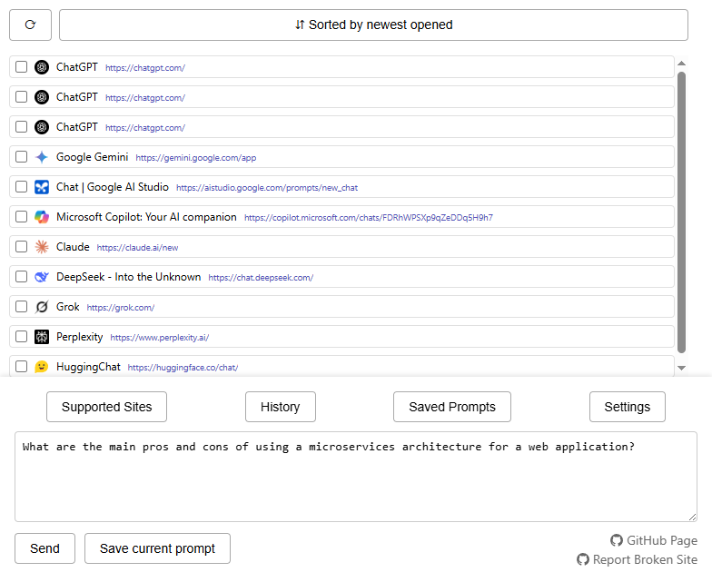
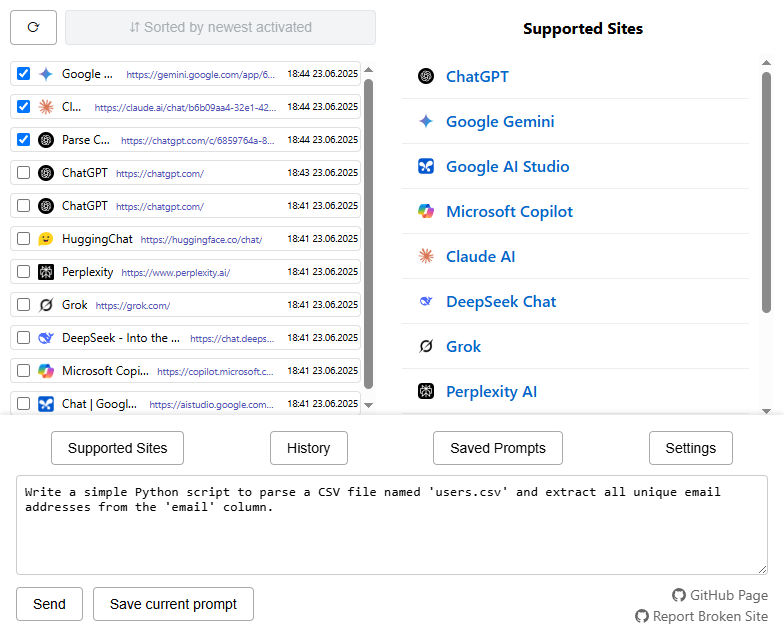
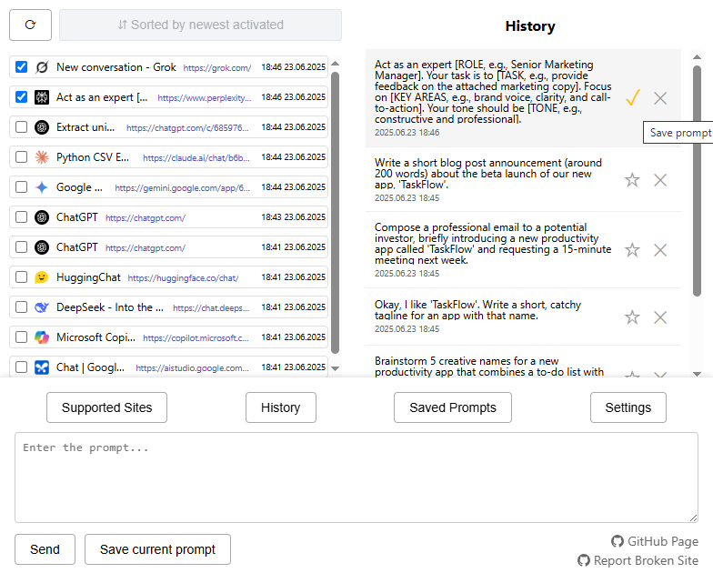
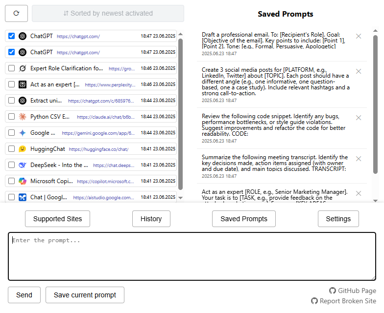
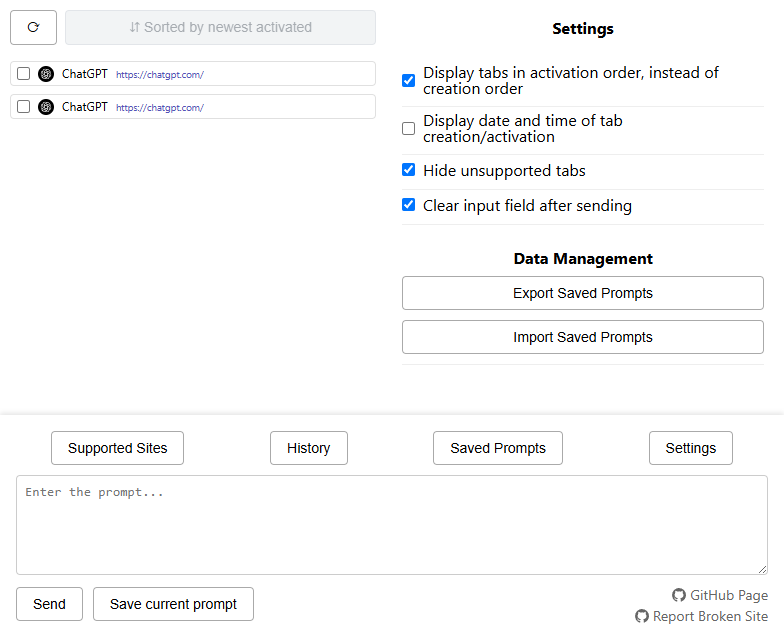

# MultiChatbot Chrome Extension

**MultiChatbot** is a free and open-source Google Chrome extension that allows you to interact with multiple web-applications of most popular LLMs (Large Language Models) from a single interface. The extension features a textbox that you can use to send the same prompt to several generative AI chatbots at the same time, as well as some additional features, such as ability to save you favorite prompts for later use, and prompt history.

## Demo

## Supported Sites

- Google Search (https://google.com)
- ChatGPT (https://chatgpt.com)
- Claude AI (https://claude.ai)
- DeepSeek (https://chat.deepseek.com)
- Microsoft Copilot (https://copilot.microsoft.com/)
- Abacus AI, or ChatLLM (https://abacus.ai)
- Perplexity (https://www.perplexity.ai)
- Poe (https://poe.com/)
- Gemini (https://gemini.google.com)
- Google AI Studio (https://aistudio.google.com)
- Grok (https://grok.com)

You can suggest new sites to be added to the list by creating an issue in the [GitHub repository](https://github.com/chern-kp/multichatbot-extension/issues).

## Features

- Ability to send the same prompt to multiple AI chatbots from a single interface. Hotkey for sending the prompt: `Ctrl + Enter` (or `Cmd + Enter` on macOS).
- "Supported sites" tab with a list of all supported sites with clickable links for easy access.
- "History" tab to view a list of previously sent prompts and ability to resend them / add them to favorites.
- "Favorites" tab to save your favorite prompts for quick access.
- Ability to sort tabs by recently opened or recently activated.
- Stop the current operation at any moment.
- Import and export of prompts in JSON format.

## Usage

After installing an extension, you can open UI of the extension by left-clicking the extension icon on the browser toolbar. From there, you will see a list of all open browser tabs on the main panel of the interface. You can select the tabs you want to interact with by checking the corresponding boxes. Once you've chosen the necessary tabs, you can write your prompt and click the "Send" button to send the message to all selected tabs.

Only tabs with supported sites will be active.

## Settings

| Setting                                                         | Description                                                                                                                                                                                |
|:--------------------------------------------------------------- |:------------------------------------------------------------------------------------------------------------------------------------------------------------------------------------------ |
| **Display tabs in activation order, instead of creation order** | When enabled, the extension will display tabs in the order they were last activated, rather than the order they were created. Most recently activated tabs will be at the top of the list. |
| **Display date and time of tab creation/activation**            | When enabled, the extension will show the date and time when each tab was created or last activated respectively.                                                                          |
| **Hide unsupported tabs**                                       | When enabled, the extension will hide tabs that are not supported by the extension, instead of showing them as inactive.                                                                   |
| **Clear input field after sending**                             | When enabled, the input field will be cleared after sending a prompt.                                                                                                                      |

## Screenshots

| | |
|---|---|
|    *Main Interface* |    *Supported Sites Panel* |
|    *Prompt History* |    *Saved Prompts* |
|    *Settings* | |

## Installation

### From Chrome Web Store

You can install the extension directly from the [Chrome Web Store](https://chromewebstore.google.com/detail/multichatbot/ajpjhdipnlmhnpbjkhkjmcandikakaia).

### Manual Installation

1. Download ZIP archive from the [Releases page](https://github.com/chern-kp/multichatbot-extension/releases)
2. Extract the ZIP file
3. Open Chrome (or another Chromium-based browser) and go to `chrome://extensions/`
4. Enable "Developer mode" in the top right corner
5. Click "Load unpacked" and select the folder where you extracted the ZIP file

## Requirements

Google Chrome or another Chromium-based browser (e.g. Microsoft Edge, Brave, etc.) with support of Manifest V3 extensions (For Chrome: version 88 or later)

## Known Issues

Some sites may drastically change their HTML structure, which could break the extension's functionality. If you noticed that a specific site stopped working, please create an issue on the [Issues page](https://github.com/chern-kp/multichatbot-extension/issues).

## Contributing

If you want to contribute to the project, feel free to fork the repository and to create a pull request.

## Roadmap / Future Plans

- Advanced edit of saved prompts (e.g. ability to edit prompt text, add title, etc.)
- Search functionality for saved prompts and history.
- Localization support for different languages.
- Support for more sites.

## License
This project is licensed under the MIT License. See the [LICENSE](LICENSE) for details.

## Privacy Policy
See [PRIVACY.md](PRIVACY.md) for details on data usage and user privacy.
